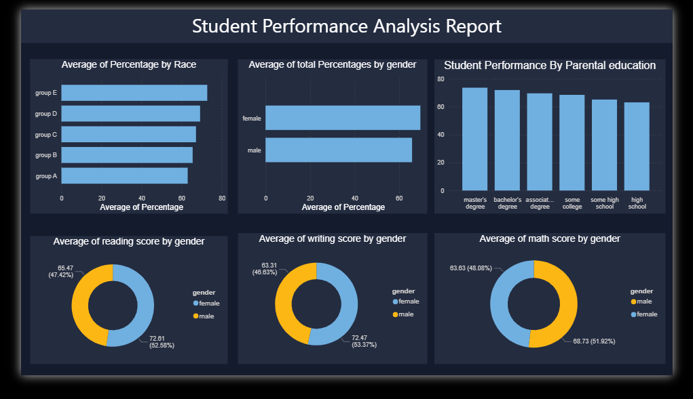

# 📊 Student Performance Analysis Dashboard

[](https://www.python.org/)
[](https://jupyter.org/)
[](https://powerbi.microsoft.com/)
[](https://pandas.pydata.org/)
[](https://github.com/RoshaanT1/Student-Analysis-Report-EDA)

> 🎓 **Comprehensive Exploratory Data Analysis (EDA) of student performance patterns across demographics, featuring interactive Power BI visualizations and statistical insights for educational stakeholders.**

---

## 🌟 Project Overview

This project conducts an in-depth **Exploratory Data Analysis (EDA)** on student performance data from Kaggle, revealing critical patterns in educational outcomes. Using Python for statistical analysis and Power BI for interactive visualization, we uncover how demographic and socioeconomic factors influence academic achievement across Mathematics, Reading, and Writing subjects.

### 🎯 **Key Objectives**
- Analyze performance patterns across different demographic groups
- Identify factors that contribute to academic success
- Create actionable insights for educational policy decisions
- Build interactive dashboards for stakeholder engagement

---

## 🚀 Key Features

- **📈 Statistical Analysis** - Comprehensive EDA using Python and Pandas
- **📊 Interactive Dashboard** - Professional Power BI visualizations with drill-down capabilities
- **🎯 Performance Segmentation** - Students categorized into Low (0-60%), Medium (60-80%), and High (80-100%) performers
- **📋 Correlation Analysis** - Subject-wise performance relationships and demographic impacts
- **🔄 Reproducible Research** - Well-documented Jupyter notebook with clear methodology

---

## 📊 Dashboard Preview



*Interactive Power BI dashboard featuring performance distributions, demographic analysis, and comparative visualizations across multiple dimensions.*

### 🖼️ **Dashboard Features Implemented**
- **Performance Overview Cards** - Key metrics and total student counts
- **Subject Score Distributions** - Math, Reading, and Writing performance histograms
- **Demographic Breakdowns** - Gender, ethnicity, and parental education analysis
- **Interactive Filters** - Dynamic filtering by all demographic variables
- **Correlation Matrices** - Visual representation of subject relationships
- **Top Performer Analysis** - Characteristics of highest-achieving students

---

## 🔍 Research Questions & Key Findings

### ✅ **1. Parental Education Impact**
**Question**: Which parental education level correlates with highest student performance?
- **Finding**: Students with parents holding **master's degrees** show the highest average math scores
- **Insight**: Clear positive correlation between parental education level and student outcomes

### ✅ **2. Gender Performance Patterns**  
**Question**: How do gender differences manifest across different subjects?
- **Finding**: **Females excel in reading and writing**, while **males show slight advantages in mathematics**
- **Insight**: Writing demonstrates the most significant gender-based performance gap

### ✅ **3. Test Preparation Effectiveness**
**Question**: Does test preparation course completion improve academic outcomes?
- **Finding**: Students completing prep courses show **consistent improvement across all subjects**
- **Insight**: Most significant impact observed in mathematics performance enhancement

### ✅ **4. Top 10% Performer Demographics**
**Question**: What demographic combinations produce top 10% performers?
- **Finding**: High performers typically have:
  - Parents with higher education levels
  - Standard lunch programs (higher socioeconomic status)  
  - Completed test preparation courses
- **Insight**: Socioeconomic advantages compound to create performance gaps

### ✅ **5. Socioeconomic Impact Analysis**
**Question**: How does lunch type impact performance across ethnic groups?
- **Finding**: Lunch type (socioeconomic indicator) shows varying effects across different racial/ethnic groups
- **Insight**: Economic disadvantage affects some groups more severely than others

### ✅ **6. Subject Correlation Patterns**
**Question**: What are the correlation patterns between different subjects?
- **Finding**: **Strong positive correlation** between reading and writing scores (r > 0.95)
- **Insight**: Students strong in language arts tend to excel in both reading and writing

### ✅ **7. High Achiever Characteristics**
**Question**: Who are the top-performing students demographically?
- **Finding**: Top performers cluster around specific demographic intersections
- **Insight**: Multiple advantage factors (education, economics, preparation) create academic excellence

---

## 📊 Dataset Information

- **📋 Source**: [Kaggle - Students Performance in Exams](https://www.kaggle.com/datasets/spscientist/students-performance-in-exams)
- **📈 Size**: 1,000 student records
- **🔧 Processing**: 8 original features + 2 engineered features
- **🎯 Subjects**: Mathematics, Reading, Writing (0-100 scale)

### 📋 **Data Schema**

| Variable | Description | Type | Values |
|----------|-------------|------|---------|
| `gender` | Student gender | Categorical | male, female |
| `race/ethnicity` | Ethnic group classification | Categorical | group A, B, C, D, E |
| `parental level of education` | Highest parent education | Categorical | some high school, high school, some college, associate's degree, bachelor's degree, master's degree |
| `lunch` | Lunch program type | Categorical | standard, free/reduced |
| `test preparation course` | Prep course status | Categorical | none, completed |
| `math score` | Mathematics test score | Numerical | 0-100 |
| `reading score` | Reading test score | Numerical | 0-100 |
| `writing score` | Writing test score | Numerical | 0-100 |
| `total_percentage` | Average across all subjects | Numerical | 0-100 (engineered) |
| `Performance Category` | Academic performance tier | Categorical | Low, Medium, High (engineered) |

---

## 🛠️ Technical Implementation

### **🔬 Analysis Pipeline**
1. **Data Acquisition** - Kaggle API integration with KaggleHub
2. **Exploratory Analysis** - Statistical summaries and distribution analysis  
3. **Feature Engineering** - Performance categorization and percentage calculations
4. **Correlation Analysis** - Subject relationship mapping and demographic segmentation
5. **Visualization Development** - Power BI dashboard creation with interactive elements

### **💻 Technology Stack**
- **Python 3.8+** - Core analysis environment
- **Pandas** - Data manipulation and statistical analysis
- **KaggleHub** - Dataset acquisition and management
- **Jupyter Notebook** - Interactive development and documentation
- **Power BI Desktop** - Business intelligence and dashboard creation
- **Git** - Version control and collaboration

---

## 🚀 Getting Started

### **📋 Prerequisites**

```bash
# Install required Python packages
pip install kagglehub pandas jupyter matplotlib seaborn numpy
```

### **⚡ Quick Start**

1. **Clone Repository**
   ```bash
   git clone https://github.com/RoshaanT1/Student-Analysis-Report-EDA.git
   cd Student-Analysis-Report-EDA
   ```

2. **Launch Analysis Environment**
   ```bash
   jupyter notebook DataAnalysis.ipynb
   ```

3. **Open Interactive Dashboard**
   - Open `StudentAnalysisReport.pbix` in Power BI Desktop
   - Refresh data connections if prompted
   - Explore interactive visualizations and filters

### **📊 Running the Analysis**

```python
# Load dataset from Kaggle
import kagglehub
from kagglehub import KaggleDatasetAdapter
import pandas as pd

# Load the student performance dataset
df = kagglehub.load_dataset(
    KaggleDatasetAdapter.PANDAS,
    "spscientist/students-performance-in-exams",
    "StudentsPerformance.csv"
)

```

---

## 📁 Project Structure

```
📦 Student-Analysis-Report-EDA/
├── 📊 DataAnalysis.ipynb              # Main EDA notebook with analysis
├── 🎛️ StudentAnalysisReport.pbix     # Interactive Power BI dashboard  
├── 📄 students_performance.csv        # Processed dataset with engineered features
├── 📖 README.md                       # Project documentation
├── 📁 assets/                         # Visual assets and screenshots
│   └── 🖼️ dashboard-main.png         # Dashboard preview image
├── 📁 .git/                          # Version control
└── 📁 .ipynb_checkpoints/            # Jupyter notebook checkpoints
```

---

## 📈 Performance Insights Summary

### **🏆 High Performers (80-100%)**
- **Demographics**: Predominantly students with educated parents and economic advantages
- **Characteristics**: Completed test prep, standard lunch programs, diverse gender representation
- **Subjects**: Strong across all three subjects with particular excellence in reading/writing correlation

### **📊 Medium Performers (60-80%)**  
- **Demographics**: Mixed socioeconomic backgrounds with varying parental education
- **Characteristics**: Some test preparation, mixed lunch program participation
- **Subjects**: Solid performance with room for improvement, especially in mathematics

### **📉 Low Performers (0-60%)**
- **Demographics**: Often from economically disadvantaged backgrounds
- **Characteristics**: Limited test preparation access, higher free/reduced lunch participation
- **Subjects**: Challenges across all subjects, requiring targeted intervention strategies

---

## 🎯 Business Impact & Applications

### **🏫 For Educational Institutions**
- **Resource Allocation**: Target support programs for students from disadvantaged backgrounds
- **Curriculum Design**: Address gender-specific subject performance gaps
- **Test Prep Programs**: Expand access to preparation courses for underserved populations

### **📊 For Policy Makers**
- **Equity Analysis**: Understanding how socioeconomic factors impact educational outcomes
- **Intervention Strategies**: Data-driven approaches to reducing achievement gaps
- **Resource Distribution**: Evidence-based allocation of educational resources

### **👨‍👩‍👧‍👦 For Parents & Students**
- **Performance Expectations**: Understanding factors that contribute to academic success
- **Preparation Strategies**: Importance of test preparation and study support
- **Subject Focus**: Identifying areas where additional support may be beneficial

---

## 🤝 Contributing

We welcome contributions to enhance this analysis! Here's how you can contribute:

1. **Fork the repository**
2. **Create feature branch** (`git checkout -b feature/EnhancedAnalysis`)
3. **Commit changes** (`git commit -m 'Add advanced statistical analysis'`)
4. **Push to branch** (`git push origin feature/EnhancedAnalysis`)
5. **Open Pull Request**

### **🔧 Contribution Ideas**
- Additional statistical tests and hypothesis testing
- Machine learning predictive models
- Enhanced visualizations and dashboard features
- Comparative analysis with other educational datasets

---

## 📄 License

This project is licensed under the MIT License - see the [LICENSE](LICENSE) file for details.

---


## Acknowledgments

- **Dataset Source**: [Kaggle Community](https://www.kaggle.com/datasets/spscientist/students-performance-in-exams) for providing the comprehensive student performance dataset

---


⭐ **If this analysis helped you understand student performance patterns, please consider giving it a star!** ⭐

